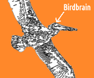
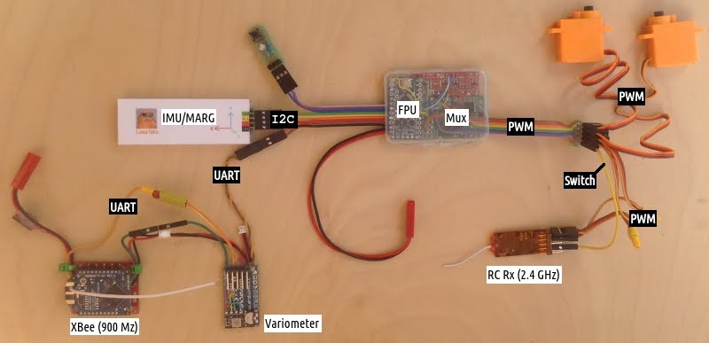
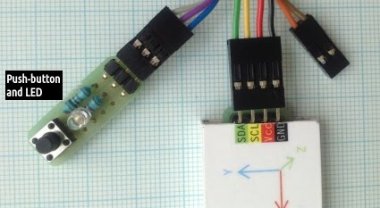
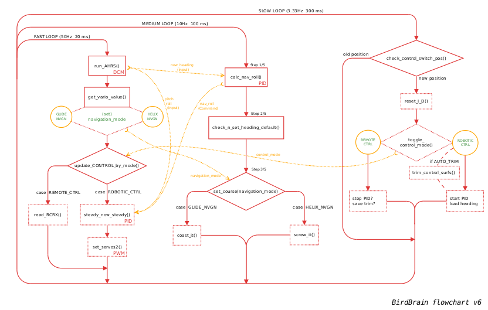
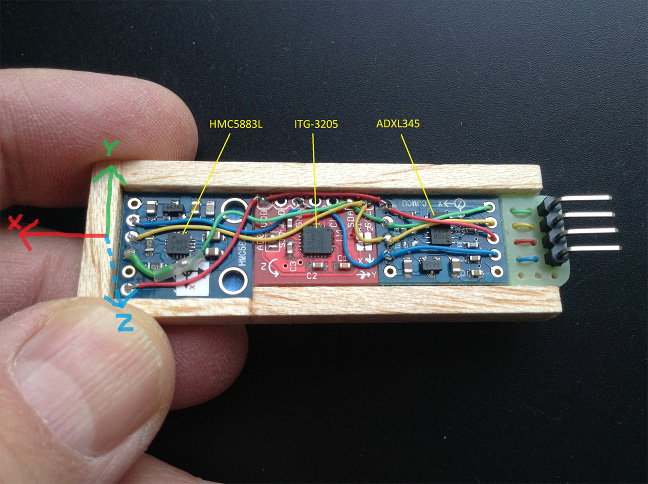

 

## BirdBrain

The bulk of the code in this project for an autopilot for soaring UAVs stems from two separate sources: 

The Attitude and Heading Reference System (AHRS), which is used for interpreting the IMU data stream through sensor fusion, is a cut-down and simplified version of Peter Bartz's splendid [Razor](https://github.com/Razor-AHRS)  AHRS. 

The rest of the BirdBrain code is, for the most part, the result of radically reducing DIY Drones' somewhat bloated ArduPilot v2.7.1 code-base to a minimum, keeping only the functions considered strictly necessary for this particular application as a basic autopilot for non-powered gliders. This meant, among other things, that everything having to do with GPS, various obsolete types of sensors, track-following, turnpoint navigation, throttle management, automatic take-offs and landings or egg-dropping (sic), etc, was left out.

 

Some notable "user-interface" features of our application:

- If A0 and A1 pins are jumpered (connected) on start-up, BirdBrain goes into a special sensor calibration mode. Note that this is only useful while being connected to a computer with two-way serial communication so that the sensor test and calibration sketches from the Razor project [tutorial](https://github.com/Razor-AHRS/razor-9dof-ahrs/wiki/tutorial) on github may be used.

- To store a suitable default heading value in volatile memory before a flight, the model is simply pointed in the desired direction and a connected momentary switch held for a couple of seconds until the confirmation LED lights up.
           
 

The various system tasks are scheduled to run at different speeds, either 50Hz, 10Hz or 3.33 Hz:

- The inner (fastest) loop includes the AHRS routines, vario-reading, the stabilisation PID and servo-driving.
- The middle loop involves the navigation PID and navigation mode selection.
- In the outer loop the state of the R/C control switch is checked and its corresponding control mode selected.

 
 
 

***
Link to project description: https://sites.google.com/site/xnebmisc/home/birdbrain

